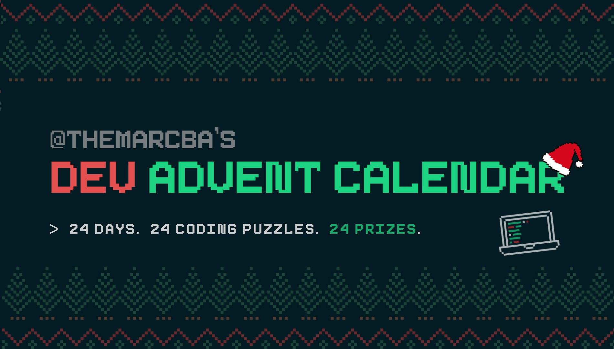
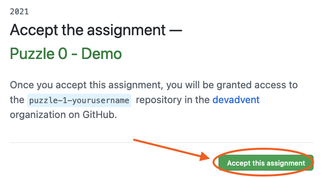
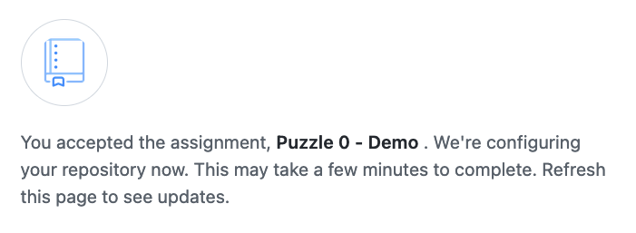
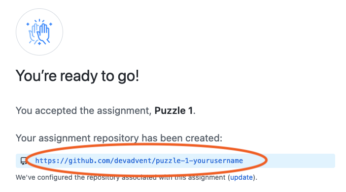

# 📖 Guide to participate in the contest

## Short guide |---|

1. Every day I upload a new puzzle as public repository to the [devadvent account](https://github.com/devadvent)
2. That puzzle has a description of what it is about and a link to _GitHub classrooms_
3. Everyone with a GitHub account can click on the link where a repository based on the puzzle is created
4. You can then clone that repository and make the changes necessary to solve the puzzle
5. Some puzzle have tests. These are used to evaluate if the puzzle is solved to satisfaction.
6. Once you solved and successfully tested the puzzle, push the content to the `main` branch.
7. Done. I will see this and take your solution into account for winning the daily prize.
8. I will contact you through Twitter to announce your prize in case you are the selected winner

## Long guide |-------------------|

### Entering the competition

In order to enter the competition, select the current puzzle from the [list of puzzles](https://github.com/devadvent) for the current day.

-   `2021-puzzle-1` is December 1st
-   `2021-puzzle-2` is December 2nd
-   `2021-puzzle-3` is December 3rd
-   etc.

In the `README.md` of each repository is a `Link` section at the very bottom of the description with a URL to click.

Click that link, and then `Accept this assignment`:


This will create a clone of the template repository for you.


This might take a few seconds. You have to reload the site manually. Once you've done that, something like this appears:


**THAT** is the link of YOUR repository to work on.

### Cloning the repository

In order to clone the repository to your laptop, enter the following command (using **YOUR** link):

```bash
git clone https://github.com/devadvent/puzzle-1-yourusername
```

### Install the dependencies

Most puzzles will need you to install project dependencies to run it. The command will be the same for **all puzzles**. It depends if you use Yarn or NPM:

```bash
yarn install
```

or

```bash
npm install
```

### ⚙️ Run the code

Run the code with

**Yarn:**

```bash
yarn dev
```

**NPM:**

```bash
npm run dev
```

### Creating your solution for the puzzle

I try to make each puzzle relatively easy, so that also beginners can participate.

Every puzzle comes with a story behind it and some technical explanation for what is expected from a working solution.

### Test your solution

As most puzzles will have tests, it makes sense to run the tests before submitting your results. This runs a series of tests on your code to determine whether it does what it is supposed to.

Running tests is the same for **all puzzles**. It depends if you use Yarn or NPM:

```bash
yarn test
```

**NPM:**

```bash
npm test
```

### Add your Twitter handle

In order to be able to win, follow me [@themarcba](https://twitter.com/themarcba) and add your Twitter handle to the `twitter.js` file of your project.

### Submit your solution

To submit your solution, you just need to push the changes to your `main` branch.

```bash
git add .
git commit -am 'Your commit message'
git push origin main
```

Done ✨
