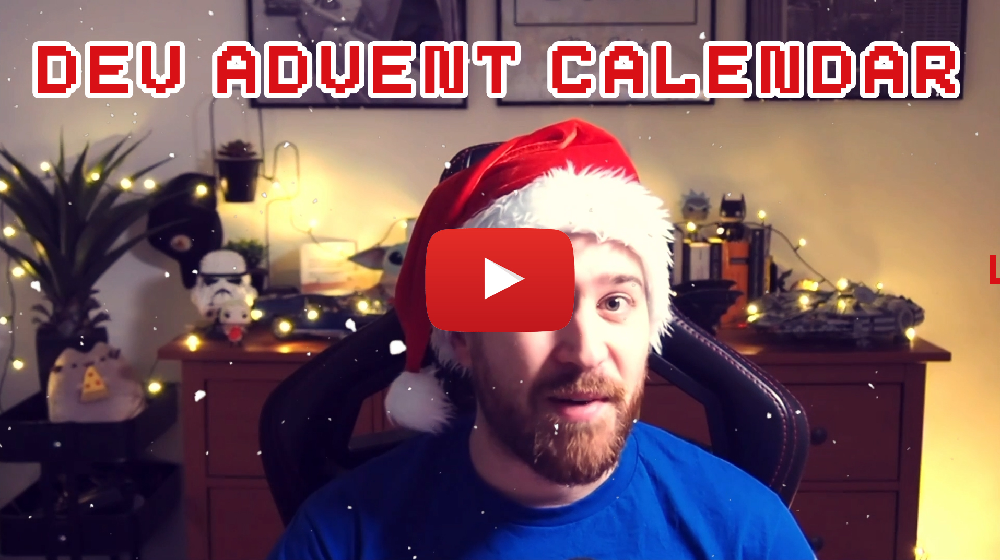

# 🎅 Dev Advent Calendar

## The idea 💡

The **Dev Advent Calendar** is an initiative by [@themarcba](https://twitter.com/themarcba) in order to give back to the community and learn something on the way.

For every day from the **1st to the 24th of December**, I will push an Xmas-themed coding puzzle as a repository to this organization. A demo puzzle is at [devadvent/2021-puzzle-0](https://github.com/devadvent/2021-puzzle-0).

Your code will remain private and can only be seen by me. However, I might show the code of the accepted solution in a repository or on my Twitter feed ([@themarcba](https://twitter.com/themarcba)).

For every puzzle, the winner will be picked **at random** from **all valid solutions**. Most puzzles will provide tests, so you can verify your solution with `yarn test`/`npm test`. (More to this, check out the [guide on how to participate](CONTRIBUTING.md))

**Only solutions that pass all tests are considered for winning the daily prize.**

## The prizes 🏆

Some prizes are donations from generous people and companies, some are provided by me personally.
They range from ebooks, courses, and swag - to conference tickets.

The prize that is to be won every day will be announced together with the winner within the next days of the puzzle. (I'll try to do it right the next day, but no guarantees)

If one day there are **no valid submissions**, the prize for that day goes into the jackpot and will be given to the next winner.

## Code Quality 📐

Always try to do your best work, and to make your code as readable as possible.

**HOWEVER** ❗ I will **not** judge your code on how you solved a certain problem or which method you used. The point of all of this is to have fun and write some code.

## Rules ☝️

-   ✅ You **can** and are even **encouraged** to participate on multiple (heck, even ALL) of the puzzles.
-   ⚠️ If the puzzle has tests, they **all need to pass** in order to qualify for the prize.
-   🚫 **Don't** upload multiple submissions for the same puzzle.
-   🚫 **Don't** modify or remove any tests.

## Participate 🚀

Participating requires you to have a GitHub account.
You can find detailed instructions on how to participate in [this guide 📖](CONTRIBUTING.md)

# 🧩 Puzzles

## Day 1

Weeks before Christmas, Santa's reindeers start practicing their flying in order to be fit for the big night. Unfortunately, one of them (Rudolf) crashed and landed in the forest 🌲

Now, Santa 🎅 needs YOUR help to find him.

[https://github.com/devadvent/puzzle-1](https://github.com/devadvent/puzzle-1)

📊 99 submissions / 71 valid solutions

🏆 Winner: [@nuenanas](https://twitter.com/nuenanas)

## Day 2

The Elf Coffee Shop ElfCup with straw needs your help to create the menu for the newly reopened place where the elves get their daily cup of _whatever drink tickles their fancy_.

[https://github.com/devadvent/puzzle-2](https://github.com/devadvent/puzzle-2)
